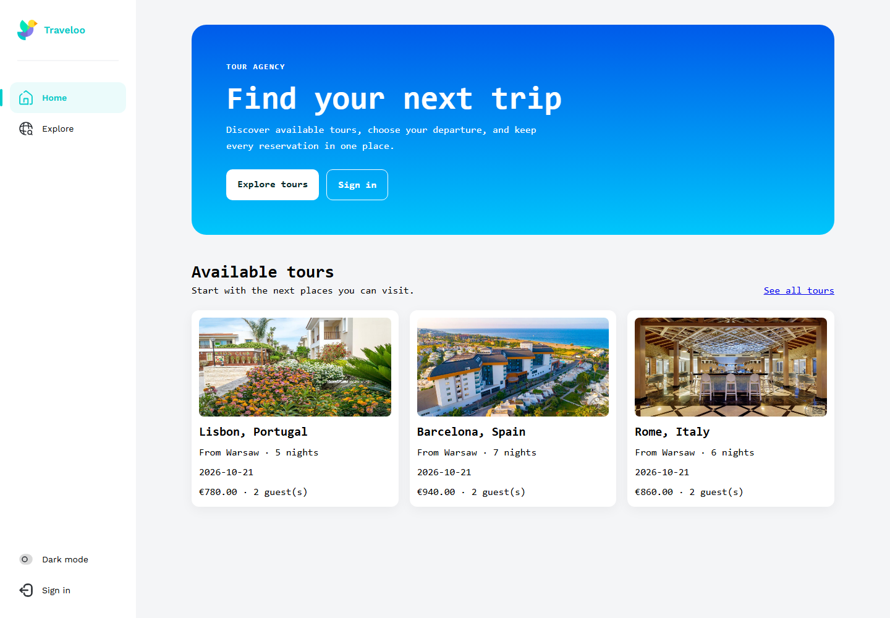
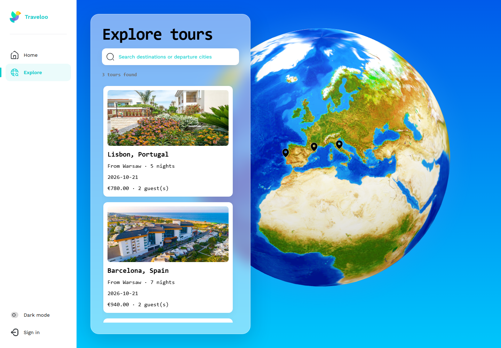

# Tour Agency

[](https://github.com/Rariramz/Tour-Agency/actions/workflows/ci.yml)

Tour Agency is a modernized version of my 2023 bachelor's diploma project, a travel application centered on tour discovery and an interactive 3D globe. The original project and Git history date from 2023; the repository was revisited in 2026 to restore and complete the full-stack application, improve security and validation, add automated tests and CI, and make the project reproducible with Docker.

## Project preview

| Home dashboard | Interactive tour explorer |
| --- | --- |
| [](docs/screenshots/home.png) | [](docs/screenshots/explore.png) |

## What it does

- Browse and search tours on a responsive catalogue and interactive 3D globe.
- Register or sign in as a client, reserve a departure for a party, and review upcoming bookings.
- Sign in as an administrator to create tours with dates, prices, routes, and uploaded images.
- Explore the REST contract through Swagger at `/api/docs`.

The refresh deliberately preserves the original Git history while improving security, validation, tests, UX, and deployment. This is a full-stack engineering project rather than an AI model demo; it complements ML work by showing how data-backed products are designed and shipped.

## Project history

- **2023 — Bachelor's diploma project.** Designed the travel-service application and developed the original React and TypeScript client, including the interactive globe and tour-discovery UI. The repository continued evolving after the thesis submission with additional backend functionality.
- **2026 — Portfolio refresh.** Restored and modernized the application, completed the current full-stack workflow, strengthened authentication, authorization, and validation, and added tests, Docker-based environments, CI, deployment configuration, and documentation.

## Architecture

| Layer | Main technologies | Responsibilities |
| --- | --- | --- |
| Web client | React 18, TypeScript, Redux Toolkit Query, React Three Fiber, SCSS | Routing, session state, search, booking and globe visualisation |
| API | NestJS, TypeScript, Swagger, JWT, class-validator | Authentication, authorization, tours, reservations and uploads |
| Data | PostgreSQL, Sequelize | Users, roles, tours and reservation records |
| Delivery | Docker Compose, nginx, GitHub Actions | Reverse proxy, persistent data, health checks and verification |

The browser calls same-origin `/api` and `/media` routes. In production nginx serves the single-page application and proxies those routes to NestJS; the API is the only service that talks to PostgreSQL.

## Run locally

Prerequisites: Node.js 22+, npm, and Docker with Compose.

```bash
node scripts/setup-local.mjs
docker compose up -d
cd backend
npm ci
npm run seed:demo
npm run start:dev
```

The setup command prints a randomly generated local administrator password. In a second terminal:

```bash
cd frontend
npm ci
npm start
```

Open `http://localhost:7001`. The API runs at `http://localhost:5000`; Swagger is at `http://localhost:5000/api/docs`. Register through the UI for the client flow, or use the generated `admin@tour-agency.local` credentials for tour management. Demo seeding is idempotent and refuses production or non-local databases.

To stop the database, run `docker compose down`. Add `--volumes` only when you intentionally want to delete local database data.

## Run the production stack

Set strong secrets in your shell or a local root `.env` file (ignored by Git), then build and start the isolated stack:

```bash
DB_PASSWORD=replace-with-a-strong-password \
JWT_SECRET=replace-with-at-least-32-random-characters \
docker compose -f compose.prod.yaml up --build -d
```

On PowerShell, set `$env:DB_PASSWORD` and `$env:JWT_SECRET` first, then run the Compose command. Open `http://localhost:8080`. Only nginx is exposed; PostgreSQL and NestJS stay on the internal network. Database and uploaded-image volumes persist across container restarts.

## Verification

```bash
cd backend
npm test -- --runInBand
npm run test:e2e -- --runInBand  # requires the local database
npm run build

cd ../frontend
npm test -- --runInBand
npm run typecheck
npm run build:prod
```

CI runs the same unit, integration, type and production-build checks with an ephemeral PostgreSQL service.

## Engineering notes and current limits

- Passwords are hashed with bcrypt; JWT secrets and database credentials are required environment configuration.
- Client DTOs are allow-listed and role checks protect administrator and reservation endpoints.
- The current upload volume is appropriate for a single-instance demonstration. An object store would be the next step for horizontal scaling.
- The globe texture is losslessly compressed, loaded with the lazy Explore route, content-hashed, and served with immutable production caching. It remains the largest first-visit asset; further reduction would trade away the original visual fidelity.
- The project uses a compact startup migration for its restored legacy schema. A versioned migration framework should replace this before multi-environment production use.
